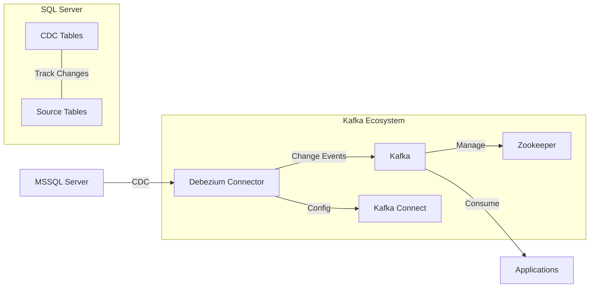
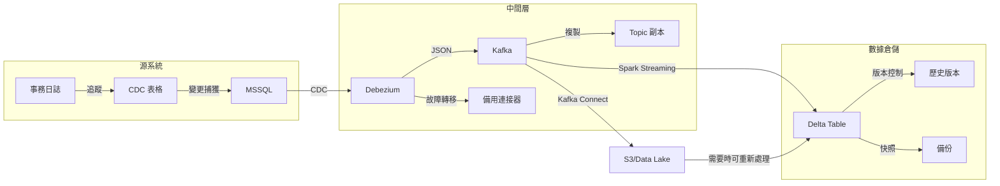

# MSSQL to Kafka CDC 示例

这是一个使用 Debezium 实现 MSSQL 到 Kafka 的 CDC（变更数据捕获）示例项目。

## 系统架构



## 项目结构

- `docker-compose.yml`: 定义所需的服务（MSSQL、Kafka、Zookeeper、Debezium Connect）
- `init.sql`: MSSQL 数据库初始化脚本
- `performance_test.sql`: 性能测试脚本

## 使用说明

1. 启动所有服务：
```bash
docker-compose up -d
```

2. 等待所有服务启动完成（约1-2分钟），然后初始化数据库：
```bash
docker exec -i cdc_example-sqlserver-1 /opt/mssql-tools18/bin/sqlcmd -S localhost -U sa -P Password123! -C -i /var/opt/mssql/init.sql
```

資料行 __$operation 會記錄與變更相關聯的作業：1 = 刪除、2 = 插入、3 = 更新 (建立資料影像前)，以及 4 = 更新 (建立資料影像後)

3. 配置 Debezium SQL Server 连接器：
# Windows PowerShell 环境
```powershell
$body = @{
    name = "sqlserver-connector"
    config = @{
        "connector.class" = "io.debezium.connector.sqlserver.SqlServerConnector"
        "database.hostname" = "sqlserver"
        "database.port" = "1433"
        "database.user" = "sa"
        "database.password" = "Password123!"
        "database.names" = "TestDB"
        "topic.prefix" = "sqlserver"
        "table.include.list" = "dbo.Customers"
        "poll.interval.ms" = 1000
        "schema.history.internal.kafka.bootstrap.servers" = "kafka:29092"
        "schema.history.internal.kafka.topic" = "schema-changes.customers"
        "database.encrypt" = "true"
        "database.trustServerCertificate" = "true"
    }
} | ConvertTo-Json -Depth 10

Invoke-RestMethod -Method Post -Uri "http://127.0.0.1:8083/connectors" -Headers @{"Content-Type"="application/json"} -Body $body
```

# Linux/macOS 环境
```bash
curl -X POST http://127.0.0.1:8083/connectors -H "Content-Type: application/json" -d '{
    "name": "sqlserver-connector",
    "config": {
        "connector.class": "io.debezium.connector.sqlserver.SqlServerConnector",
        "database.hostname": "sqlserver",
        "database.port": "1433",
        "database.user": "sa",
        "database.password": "Password123!",
        "database.names": "TestDB",
        "topic.prefix": "sqlserver",
        "table.include.list": "dbo.Customers",
        "poll.interval.ms": 1000,  // 預設值為 1000
        "schema.history.internal.kafka.bootstrap.servers": "kafka:29092",
        "schema.history.internal.kafka.topic": "schema-changes.customers",
        "database.encrypt": true,
        "database.trustServerCertificate": true
    }
}'
```

4. 测试数据变更：
```bash
# 连接到 SQL Server
docker exec -it cdc_example-sqlserver-1 /opt/mssql-tools18/bin/sqlcmd -S localhost -U sa -P Password123! -C

# 在 SQL 命令行中执行以下命令
USE TestDB;
GO

# 插入新记录
INSERT INTO Customers (Name, Email) VALUES (N'赵六', 'zhaoliu@example.com');
GO

# 更新记录
UPDATE Customers SET Email = 'zhangsan_new@example.com' WHERE Name = N'张三';
GO

# 删除记录
DELETE FROM Customers WHERE Name = N'李四';
GO
```
常見的操作代號（op）
r - Read（讀取）
表示這是一筆從資料庫中讀取的現有記錄，通常出現在初始快照階段，用來同步現有資料。
示例：你的資料中 "op": "r" 表示這是從 Customers 表中讀取的一筆記錄。
c - Create（創建）
表示一筆新記錄被插入到資料庫中。
資料結構中會包含 "after" 字段，顯示新插入的資料內容。
u - Update（更新）
表示一筆現有記錄被更新。
資料結構中通常會同時包含 "before"（更新前的資料）和 "after"（更新後的資料），以顯示變更的內容。
d - Delete（刪除）
表示一筆記錄被從資料庫中刪除。
資料結構中通常只會有 "before" 字段，顯示被刪除的記錄內容，"after" 會是 null


## 性能测试

本项目提供了性能测试脚本来评估 CDC 对系统性能的影响。测试包括：

1. 大量数据生成（默认1万条记录）
2. 并发操作测试（插入、更新、删除）
3. 性能指标收集（响应时间、平均操作时间）

### 执行性能测试

1. 禁用 CDC 进行基准测试：
```bash
# 连接到 SQL Server
docker exec -it cdc_example-sqlserver-1 /opt/mssql-tools18/bin/sqlcmd -S localhost -U sa -P Password123! -C

# 禁用 CDC
USE TestDB;
GO
# Start of Selection
EXEC sys.sp_cdc_disable_table @source_schema = 'dbo', @source_name = 'Customers', @capture_instance = 'dbo_Customers';
GO
EXEC sys.sp_cdc_disable_db;
GO

# 执行性能测试
:r /var/opt/mssql/performance_test.sql
EXEC PerformanceTest;
GO
```

2. 启用 CDC 进行对比测试：
```bash
# 启用 CDC
EXEC sys.sp_cdc_enable_db;
GO
EXEC sys.sp_cdc_enable_table @source_schema = 'dbo', @source_name = 'Customers', @role_name = NULL, @supports_net_changes = 1;
GO

# 执行性能测试
EXEC PerformanceTest;
GO
```

## 系统组件说明

### Zookeeper
ZooKeeper 是一個分布式協調服務系統，在 Kafka 中主要負責以下工作：
1. 集群管理：
   - 維護所有 Kafka broker（節點）的即時狀態
   - 當有新的 broker 加入或離開時，通知整個集群
2. Leader 選舉（這就是所謂的 broker 選舉）：
   - 當某個 Kafka 分區的主節點（Leader）故障時
   - ZooKeeper 會自動協調並選出新的主節點
   - 確保系統能持續正常運作，不會中斷服務
3. 配置管理：
   
   - 儲存和管理 Kafka 的重要配置信息
   - 確保所有節點都能獲得最新的配置
4. 健康監控：
   
   - 持續監控所有 Kafka 節點的健康狀態
   - 當發現節點異常時，立即採取相應措施

### AKHQ - Kafka 可视化管理工具
AKHQ 提供了直观的 Web 界面来监控和管理 Kafka 集群：
1. 访问地址：http://localhost:8080
2. 主要功能：
   - 查看 Topic 列表和消息内容
   - 监控消费者组状态
   - 跟踪数据流向
   - 管理 Kafka Connect 连接器

## 注意事项

1. 确保端口 1433、2181、9092、8083 和 8080 未被占用
2. 首次启动时，需要等待所有服务完全启动才能执行后续操作
3. 示例中的密码仅用于演示，实际使用时请使用更安全的密码
4. 性能测试会生成大量数据，请确保有足够的磁盘空间
5. CDC 会增加系统开销，建议根据实际需求权衡是否启用

## 清理环境

要停止并清理所有容器和卷，运行：
```bash
docker-compose down -v
```

## 進階實踐：完整的 ETL 同步方案

### 整體架構


### 詳細組件說明

#### 1. MSSQL CDC（變更數據捕獲）
- **啟用要求**：
  - SQL Server Enterprise 或 Developer 版本
  - 資料庫和表格層級都需要啟用 CDC
  - 適當的資料庫權限配置

- **運作機制**：
  ```sql
  -- 資料庫級別啟用 CDC
  EXEC sys.sp_cdc_enable_db;
  
  -- 表格級別啟用 CDC
  EXEC sys.sp_cdc_enable_table
    @source_schema = 'dbo',
    @source_name = 'YourTable',
    @role_name = NULL,
    @supports_net_changes = 1;
  ```

- **監控指標**：
  - CDC 延遲時間
  - 變更捕獲率
  - 系統資源使用情況

#### 2. Debezium 連接器進階配置
- **錯誤處理**：
  ```json
  {
    "errors.tolerance": "all",
    "errors.retry.timeout": "1h",
    "errors.retry.delay.max.ms": "60000",
    "errors.log.enable": true,
    "errors.log.include.messages": true
  }
  ```

- **效能優化**：
  ```json
  {
    "max.batch.size": "8192",
    "poll.interval.ms": "1000",
    "max.queue.size": "16384"
  }
  ```

#### 3. Kafka 主題設計
- **主題命名規範**：
  ```
  {環境}.{源系統}.{數據庫}.{schema}.{表格}
  ```

- **分區策略**：
  - 根據主鍵進行分區
  - 確保相同鍵值的消息進入相同分區

- **資料保留策略**：
  ```properties
  retention.ms=604800000  # 7天
  retention.bytes=1073741824  # 1GB
  ```

#### 4. Spark Streaming 處理
- **程式碼範例**：
```scala
// 讀取 Kafka 數據
val kafkaStream = spark.readStream
  .format("kafka")
  .option("kafka.bootstrap.servers", "kafka:9092")
  .option("subscribe", "sqlserver.dbo.Customers")
  .load()

// 解析 JSON 數據
val parsedStream = kafkaStream.select(
  from_json(col("value").cast("string"), schema).alias("data")
)

// 寫入 Delta Table
val query = parsedStream.writeStream
  .format("delta")
  .outputMode("append")
  .option("checkpointLocation", "/checkpoints/customers")
  .start("/tables/customers")
```

#### 5. Delta Lake 最佳實踐
- **表格優化**：
```sql
-- 定期優化表格
OPTIMIZE customers
WHERE date_trunc('day', timestamp) <= current_date - 7;

-- 設置保留期限
SET spark.databricks.delta.retentionDurationCheck.enabled = false;
VACUUM customers RETAIN 30 DAYS;
```

- **時間旅行查詢**：
```sql
-- 查看特定時間點的數據狀態
SELECT * FROM customers VERSION AS OF 123
-- 或
SELECT * FROM customers TIMESTAMP AS OF '2024-01-01'
```

### 監控與維護

#### 1. 健康檢查指標
- CDC 延遲監控
- Kafka 消息積壓情況
- Spark 處理延遲
- Delta Table 寫入效能
- 端到端數據一致性驗證

#### 2. 告警設置
```yaml
alerts:
  - name: CDC_Lag_Alert
    condition: lag_seconds > 300
    severity: high
    notification: slack
  
  - name: Kafka_Lag_Alert
    condition: consumer_lag > 10000
    severity: medium
    notification: email
```

#### 3. 故障恢復流程
1. **CDC 故障**：
   - 檢查 SQL Server 錯誤日誌
   - 驗證 CDC 表格狀態
   - 必要時重新啟用 CDC

2. **Debezium 故障**：
   - 檢查連接器狀態
   - 重啟連接器
   - 驗證數據完整性

3. **Kafka 故障**：
   - 檢查叢集健康狀態
   - 確認主題配置
   - 驗證消費者組狀態

4. **Spark 處理故障**：
   - 檢查檢查點狀態
   - 重啟串流作業
   - 驗證數據一致性

### 效能優化建議

1. **MSSQL 端**：
   - 適當配置變更追蹤保留期
   - 定期清理 CDC 表格
   - 監控交易日誌大小

2. **Kafka 端**：
   - 適當設置分區數
   - 配置合理的複製因子
   - 優化消息大小

3. **Spark 端**：
   - 調整批次間隔
   - 優化記憶體配置
   - 實作高效的序列化

4. **Delta Lake 端**：
   - 定期執行 OPTIMIZE
   - 設置適當的 Z-ORDER
   - 管理檔案大小

### 安全性考慮

1. **數據加密**：
   - 傳輸層加密（TLS/SSL）
   - 靜態數據加密
   - 敏感欄位加密

2. **訪問控制**：
   - MSSQL 權限管理
   - Kafka ACLs 配置
   - Delta Lake 訪問控制

3. **審計日誌**：
   - CDC 操作日誌
   - Kafka 操作記錄
   - Delta Lake 變更歷史